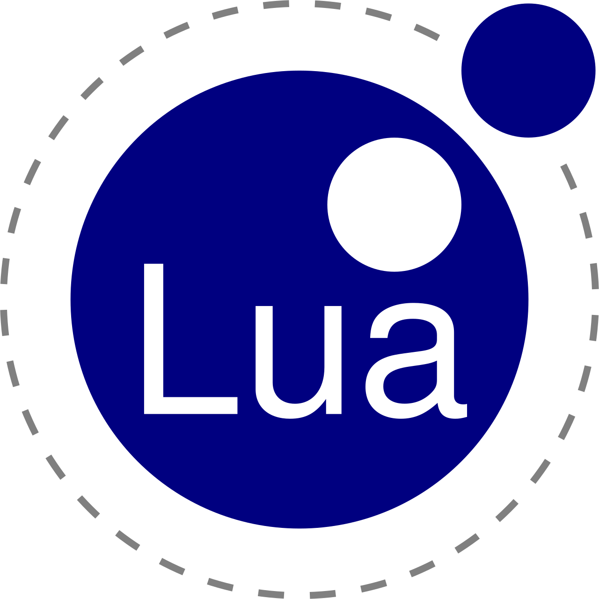
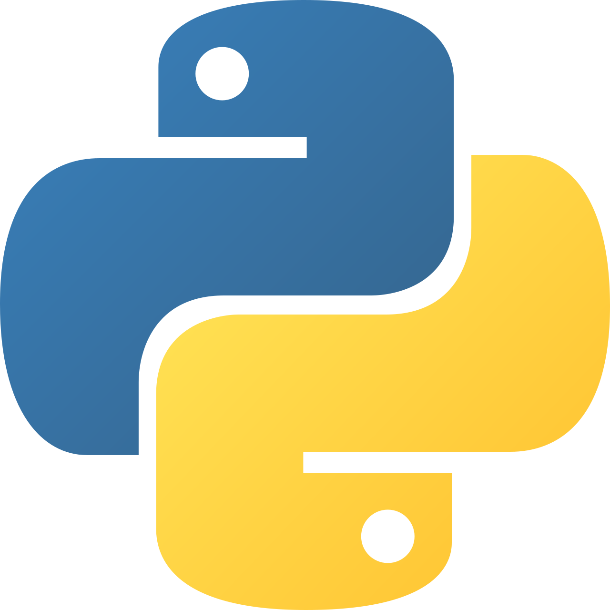
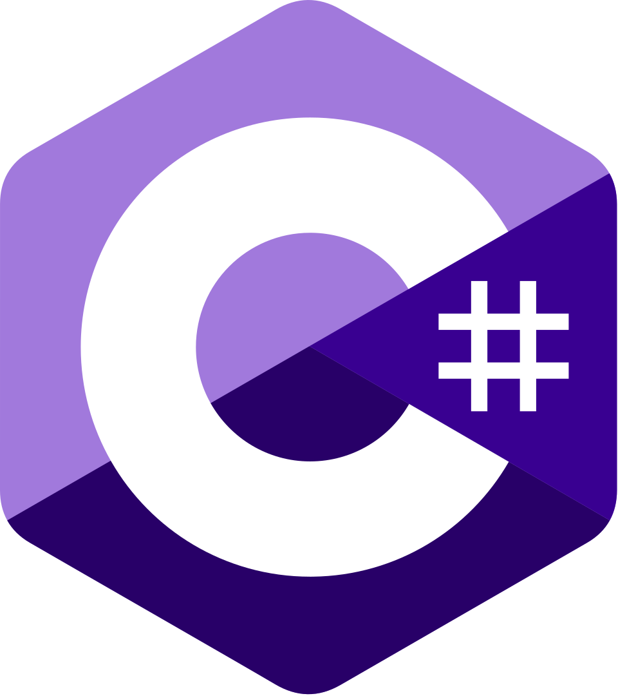
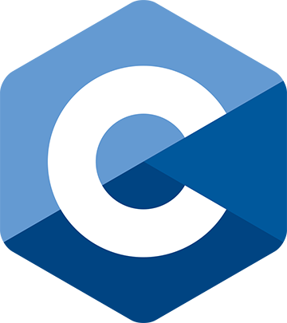

# DYLAN WASKO

## Full stack developer with 3.5 years of experience.

LUA             |  PYTHON                   | JAVA
:-------------------------:|:-------------------------:|:-------------------------:
  |   | 
C#             |  C                   | Dart
  |   | 

# Experience
3.5 years of programming experience with various languages.

Proficient with Lua and Python.

Intermediate with C# and Java.

Beginner in C and Dart.

[Itch.io](https://themooster86.itch.io/)

# Software Proficiencies
Visual Studio

Unity

Microsoft Office

Github

Flutter

